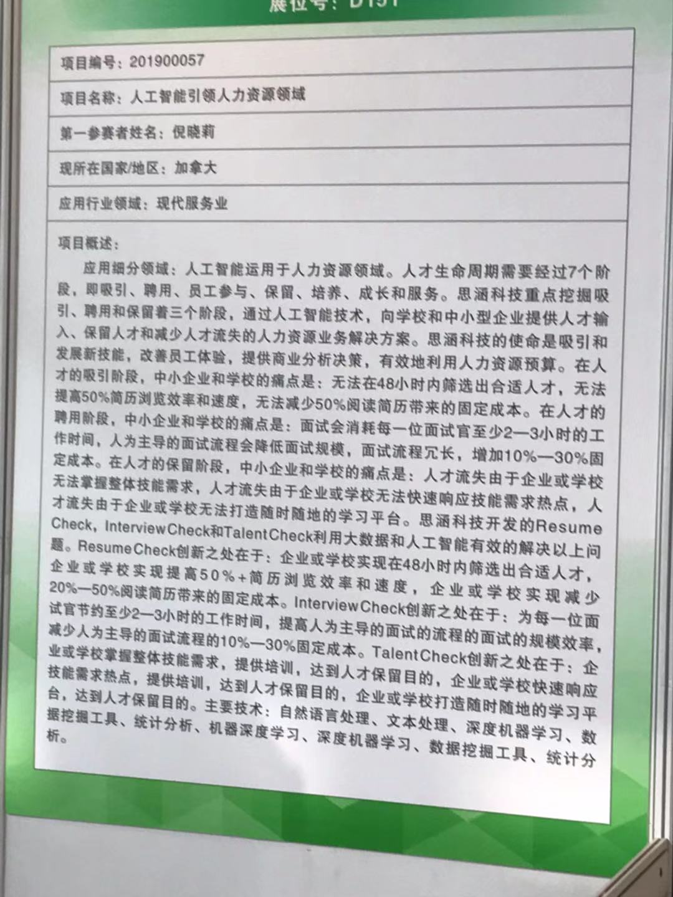

本次活动中，我查看了春晖杯的思涵科技的项目，人工智能运用于人力资源领域。

而人才生命周期需要经过7个阶段,即吸引、聘用、员工参与、保留、培养、成长和服务。

该项目主要针对了人才生命周期中其中三个阶段（吸引、聘用、保留）的痛点提出了解决方案。

分别推出了ResumeCheck解决企业或学校实现48小时内筛选出合适人才，以及提高简历浏览效率，以减少其带来的固定成本, 

InterviewCheck则为面试官节约工作时间，提高以人为主导的面试效率，减少过程中的成本，

TalentCheck则帮助企业及学校构建一个学习平台，提供培训和技能需求以达到人才保留的目的。

我总结来说，该3项服务实际上来看对企业或学校来看，实际上是在解决两类问题，一类是录用前的花费和效率问题，一类是录用后的员工培养和减轻损失。

我个人认为这3项服务存在两类问题，一是它并未考虑到人本身的才能和被记录的数据之间的重叠部分和差异部分，如果使用了这种提高效率的工具，是否会产生丢失了接触部分人才的机会，从而造成损失。

其二是，在人才保留方面公司或学校是否有必要使用这种平台去培训，因为人才流失的原因未必是缺少培训，可能也和公司福利或者公司工作时间、公司制度有关系，单凭培训而保留人才，从这方面来看，并不具备较强的说服力。

所以我的建议是，该项目应该只抓吸引前的部分即可，并且应当有一定的再次筛选的机制，而不是一遍筛选就筛掉多人，而是根据不同维度来进行必要的筛选，反而比所谓的直接单纯的提高效率要实际和有效。除此之外，该项目在人工智能的具体描述上存在一定的问题，不够明确到底使用了什么技术。
